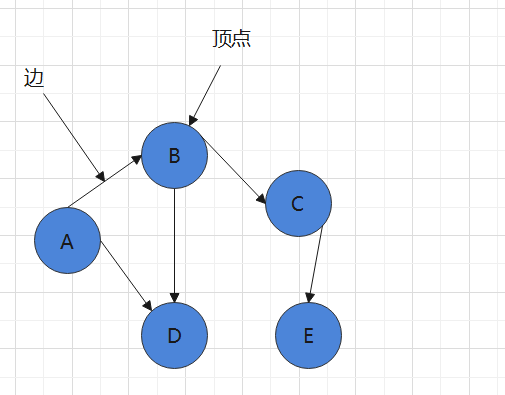
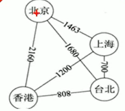
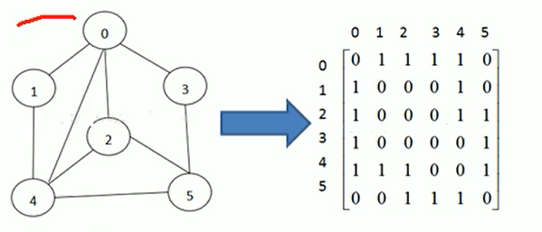
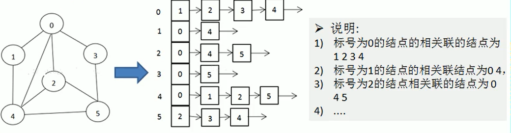
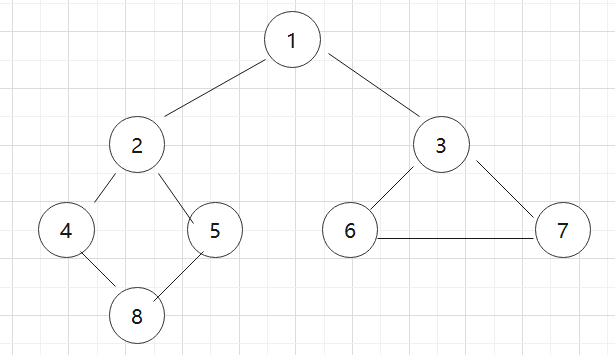
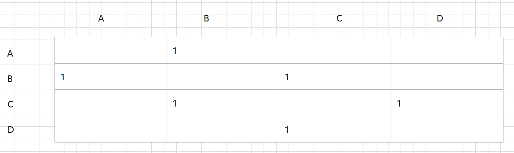
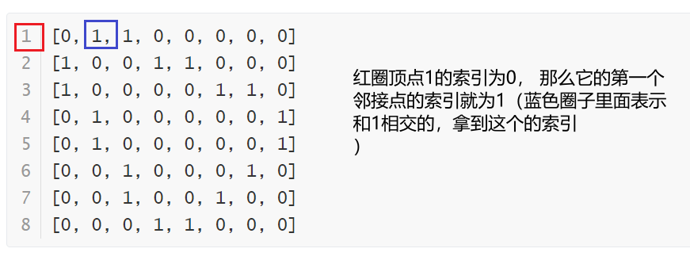

## 图结构和2种搜索算法入门

> ​	在数据的逻辑结构D=（KR）中，如果K中结点对于关系R的前趋和后继的个数不加限制，即仅含一种任意的关系，则称这种数据结构为图形结构
>
> 这是百度百科的解释，说人话， 图是一种数据结构，其中结点可以具有零个和多个相邻元素。 两个结点称为边。 结点也可以叫做顶点。 



###	1. 图的概念

1) 顶点(vertex)

2) 边（edge)

3) 路径 

   A路径有:  A -> B -> D,A -> B -> C -> E,   B有路径 B -> D，B -> C -> E

4) 有向图和无向图(有向图指的是两个元素指两个元素有方向，无向图两个元素没有方向)  比如 A->B A->D

5) 带权图。 指的是这个边的值， 比如 A-> B 的边表示10公里， B -> C的边表示 5公里。

   

###	2. 图的表示方式

#### 2.1 邻接矩阵

邻接矩阵是表示图形中顶点的之间的关系的矩阵，对于n个 顶点的图而言， 矩阵的row和col 表示的是 1...n个点。如下图所示 



### 2.2 邻接表

1. 邻接矩阵需要为第个顶点都分配n个边的空间， 其实有很多的边不存在，造成空间浪费

2. 邻接表只关心边， 不关心不存在的边。 所以没有空间浪费， 邻接表由数组 + 链表组成 

   


###	3. 图索算法

>  图搜索算法有深度优先(dfs)，和广度优先(bfs)两种。
>
> 
>
> 如果从1 这个节点为起始点来遍历， 深度优先，和广度的顺序不相同。 
>
>  深度优先搜索: 1 ，2，4，8，5，3，6，7
>
>  广度优先搜索： 1，2，3，4，5，6，7，8
>
>  由上面的遍历顺序我们可以发现深度是纵向遍历，而广度是横向遍历。
>
> 下面我们将编写两种算法和分析2种算法的具体执行流程。

####	3.1 使用代码实现邻接矩阵和邻接表

#####	3.1.1 邻接表的实现

这里暂时先留下， 后面填坑

##### 	3.1.2 邻接矩阵

下图是一个 邻接矩阵， 通过下面数据可以看到有以下关系

A - B , B - C, C-D 有连接关系， 下面的图也可以用数据结构2维数组来表示, 我们这里规定两个节点相交的时候值为1

```
int[][] = new int[4][4];
那么A - B ,在数组中表示为int[0][1] = 1,int[1][0] = 1.
那么B - C ,在数组中表示为int[0][1] = 1,int[1][0] = 1.
那么C - D ,在数组中表示为int[0][1] = 1,int[1][0] = 1.
```



代码如下

```java
	public static class Graph {
        // 顶点数据(vertex)
		private List<String> vertexts;
        // 边(节点相交数据)
		private int[][] edges;
        // 边的数量
		private int numberOfEdges;

		public Graph(int count) {
			vertexts = new ArrayList<>(count);
			edges = new int[count][count];
			isVeisited = new boolean[count];
		}

		/**
		 * 插入顶点的数据
		 * @param vertex
		 */
		public void addVertex(String vertex) {
			vertexts.add(vertex);
		}

		public String getVertext(int index) {
			return vertexts.get(index);
		}
		/**
		 * 
		 * @param v1 第一个节点的索引
		 * @param v2 第干个节点的索引
		 * @param weight 权重（这里我们规定加入两个相交权重为1）
		 */
		public void insertEdge(int v1, int v2, int weight) {
			edges[v1][v2] = weight;
			edges[v2][v1] = weight;
			numberOfEdges++;
		}
		public void insertEdge(int v1, int v2, int weight) {
			edges[v1][v2] = weight;
			edges[v2][v1] = weight;
			numberOfEdges++;
		}
		public void showGrpah() {
			for (int[] edge : edges) {
				System.out.println(Arrays.toString(edge));
			}
		}
		public String getValueByIndex(int index) {
			return vertexts.get(index);
		}
}
```

下面来测试一下代码, 假设有4个顶点分别是 数据分别为1，2，3，4，5，6，7，8 他们的索引分别是 0, 1,2,3 ,4，5，6，7，8 

```java
public class GraphDemo {
	public static void main(String[] args) throws InterruptedException {
        // 插入8个顶点
        String[] Vertexs = {"1", "2", "3", "4", "5", "6", "7", "8"};
     	Graph graph = new Graph(Vertexs.length);
		for (String s : Vertexs) {
			graph.addVertex(s);
		}

       	// 插入8条边， 
		graph.insertEdge(0, 1, 1); // 这里的第一个参数0表示顶点1的索引，第二个参数表示数据为2的顶点的索引，第三个参数表示两个顶点相交。
		graph.insertEdge(0, 2, 1);
		graph.insertEdge(1, 3, 1);
		graph.insertEdge(1, 4, 1);
		graph.insertEdge(3, 7, 1);
		graph.insertEdge(4, 7, 1);
		graph.insertEdge(2, 5, 1);
		graph.insertEdge(2, 6, 1);
		graph.insertEdge(5, 6, 1)
		// 打印出
		graph.showGrpah();
	}
}
```

运行上面的main方法，控制台打印出信息如下

```
[0, 1, 1, 0, 0, 0, 0, 0]
[1, 0, 0, 1, 1, 0, 0, 0]
[1, 0, 0, 0, 0, 1, 1, 0]
[0, 1, 0, 0, 0, 0, 0, 1]
[0, 1, 0, 0, 0, 0, 0, 1]
[0, 0, 1, 0, 0, 0, 1, 0]
[0, 0, 1, 0, 0, 1, 0, 0]
[0, 0, 0, 1, 1, 0, 0, 0]
```

通过上面的例子可以得到发现数据为1 的这个顶点的路径是 1->2->4->8->5->3->6->7 ， 或者也有1->2->3->4->5->6->7->8 ， 因为顶点相交是多对多，路径远远不止上面2条。 于是就有了下面的2种算法来求出路径。

####	3.2 深度优先搜索(Depth First Search)

在讲步骤之前先讲两个概念，

3.2.1  顶点的第一个邻接点 

第一个是根据索引拿到该索引的第一个邻接点(索引)， 比如在上面 3.1.2中的数据为1的索引的为0， 那么他的第一个邻接点就为1. 



代码如下

```java
		/**
		 * 得到该索引的第一个节点
		 *
		 * @param index
		 * @return
		 */
		public int getFirtNeighbor(int index) {
			for (int i = 0; i < vertexts.size(); i++) {
				if (edges[index][i] > 0) {
					return i;
				}
			}
			return -1;
		}
```

3.2.2  根据前一个邻接点的来获取下一个邻接点的索引


 {
			for (int i = v2 + 1; i < vertexts.size(); i++) {
				if (edges[v1][i] > 0) {
					return i;
				}
			}
			return -1;
		}
```


####         3.3 广度优先搜索(Breadth First Search)

