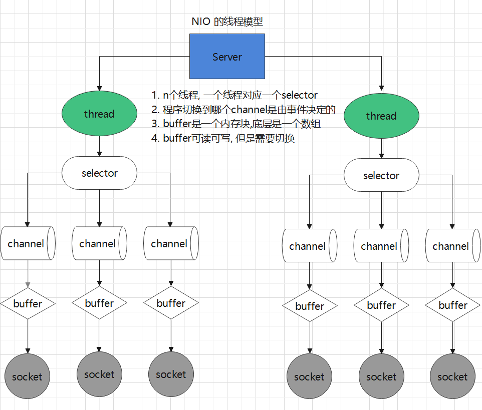
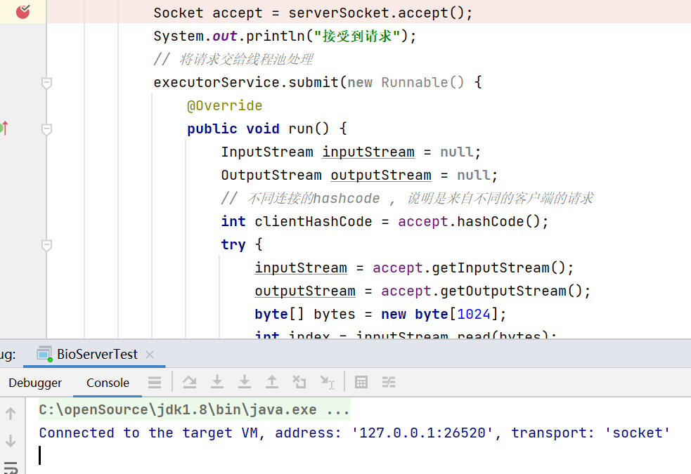
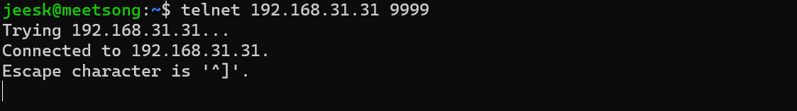
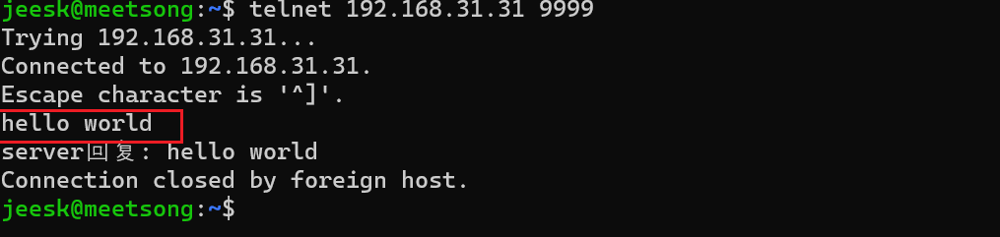
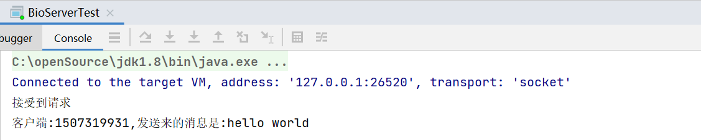
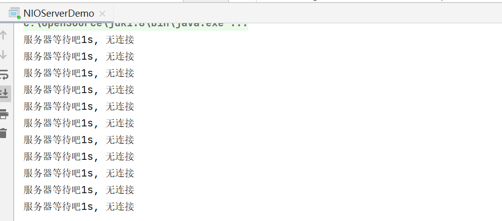
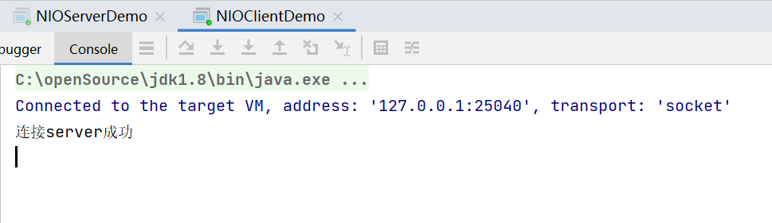
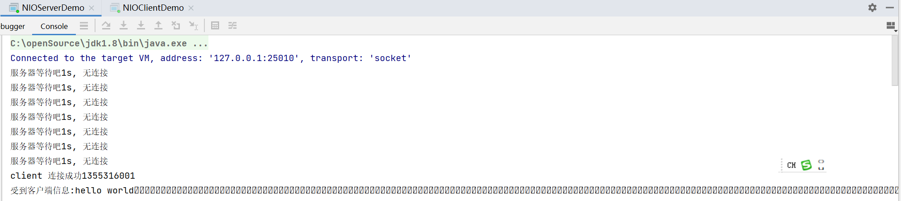

##		NIO和BIO的区别总结

###	1. 表格说明两者的区别

| IO类型 | 是否阻塞 | 同步IO | 线程模型                 |
| ------ | -------- | ------ | ------------------------ |
| BIO    | 阻塞     | 是     | 一个线程对应一个请求     |
| NIO    | 非阻塞   | 是     | 一个线程可以处理多个请求 |

###	2. 示意图说明区别





##	代码实战


###	1. BIO实战

####	1.1 编写BIO代码

> ​	目的:  实现一个server, 接受客户端发送来的消息, 并将消息返回给客户端
>
> ​    思路:
>
>  1.	首先创建一个ServerSocket , 并且绑定一个本地端口9999,
>  2.	 等待客户端连接, 然后将连接交给线程池处理
>  3.	 从inputStream 里面读取内容, 并且将内容使用outPutStream返回给客户端

```java
import java.io.IOException;
import java.io.InputStream;
import java.io.OutputStream;
import java.net.InetSocketAddress;
import java.net.ServerSocket;
import java.net.Socket;
import java.util.concurrent.ExecutorService;
import java.util.concurrent.Executors;

public class BioServerTest {
    public static void main(String[] args) throws IOException {

        // 固定10个线程,并且创建给一个serverSocket,并且绑定端口
        ExecutorService executorService = Executors.newFixedThreadPool(10);
        ServerSocket serverSocket = new ServerSocket();
        serverSocket.bind(new InetSocketAddress(9999));

        // 接受客户端的请求, 并将客户端发送来的文字, 返回给客户端
        while (true) {
            // 等待其它客户端的请求, 记住这里阻塞的,  当我们启动该程序, 这里的accept 会阻塞不动, 直到成功接收一个请求
            Socket accept = serverSocket.accept();
            System.out.println("接受到请求");
            // 将请求交给线程池处理
            executorService.submit(new Runnable() {
                @Override
                public void run() {
                    InputStream inputStream = null;
                    OutputStream outputStream = null;
                    // 不同连接的hashcode , 说明是来自不同的客户端的请求
                    int clientHashCode = accept.hashCode();
                    try {
                        inputStream = accept.getInputStream();
                        outputStream = accept.getOutputStream();
                        byte[] bytes = new byte[1024];
                        int index = inputStream.read(bytes);
                        String s = new String(bytes, 0, index);
                        System.out.println("客户端:" + clientHashCode + ",发送来的消息是:" + s);
                        outputStream.write(("server回复: " + s).getBytes());
                    } catch (IOException e) {
                        e.printStackTrace();
                    } finally {
                        try {
                            accept.close();
                        } catch (IOException e) {
                            e.printStackTrace();
                        }
                    }
                }
            });
        }

    }
}

```

####	1.2 启动程序



####	1.3	在命令行中连接客户端, 观察结果



输入hello world ,期待结果返回hello world



idea 服务端的console 如下



###	2. NIO实战

####	

> ​	目的:  通过NIO 实现client和server的交互
>
> ​    思路:
>
> ​    Server 端思路
>
> 1.  首先创建socketServerChannel,和Selctor, 将channel 注册selector 上面去
>
> 2.  等待客户端连接, 将客户端连接的channel注册到selctor上面去, 注意不同的channel有不同的事件
>
> 3.  获取获取客户端channel拿到数据
>
>
>
> ​    Client 端思路
>
> 1.	创建SocketChannel, 然后连接Server端
> 2.	当连接完成后, 向Server端发送消息

####	2.1 编写NIO代码

#####		2.2.1 Server端代码

```java
import java.io.IOException;
import java.net.InetSocketAddress;
import java.nio.ByteBuffer;
import java.nio.channels.SelectionKey;
import java.nio.channels.Selector;
import java.nio.channels.ServerSocketChannel;
import java.nio.channels.SocketChannel;
import java.util.Iterator;

public class NIOServerDemo {
    public static void main(String[] args) throws IOException {
        ServerSocketChannel serverSocketChannel = ServerSocketChannel.open();
        serverSocketChannel.configureBlocking(false);
        Selector selector = Selector.open();
        serverSocketChannel.bind(new InetSocketAddress(9999));
        // 将serverSocketChannel的可接受事件注册到selector上面,
        serverSocketChannel.register(selector, SelectionKey.OP_ACCEPT);
        while (true) {
            int resultCode = selector.select(1000);
            if (resultCode == 0) {
                System.out.println("服务器等待吧1s, 无连接");
                continue;
            }
            Iterator<SelectionKey> iterator = selector.selectedKeys().iterator();
            while (iterator.hasNext()) {
                try {
                    SelectionKey selectionKey = iterator.next();
                    // 当前事件是否可接受
                    if (selectionKey.isAcceptable()) {
                        System.out.println("client 连接成功" + serverSocketChannel.hashCode());
                        // 拿到接受的socketChannel,将客户端channel的read事件注册到selector上面去
                        SocketChannel socketChannel = serverSocketChannel.accept();
                        socketChannel.configureBlocking(false);
                        socketChannel.register(selector, SelectionKey.OP_READ, ByteBuffer.allocate(1024));
                    }
                    // 当前事件是否是可读事件
                    if (selectionKey.isReadable()) {
                        // 从channel拿到消息, 并且读取出来
                        SocketChannel channel = (SocketChannel) selectionKey.channel();
                        ByteBuffer attachment = (ByteBuffer) selectionKey.attachment();
                        channel.read(attachment);
                        System.out.println("受到客户端信息:" + new String(attachment.array()));
                    }
                } catch (Exception e) {
                    System.out.println(e);
                } finally {
                    // 最好别忘了移出key
                    iterator.remove();
                }
            }
        }
    }
}

```

#####	2.2.2 Client端代码

```java
import java.net.InetSocketAddress;
import java.nio.ByteBuffer;
import java.nio.channels.SocketChannel;
import java.nio.charset.StandardCharsets;

/**
 * socket clilent 连接server
 */
public class NIOClientDemo {
    public static void main(String[] args) throws Exception {

        // 创建SocketChannel, 并且连接本地9999 端口
        SocketChannel socketChannel = SocketChannel.open();
        InetSocketAddress inetSocketAddress = new InetSocketAddress("192.168.31.31", 9999);
        socketChannel.configureBlocking(false);
        if (!socketChannel.connect(inetSocketAddress)) {
            while (!socketChannel.finishConnect()) {
                System.out.println("连接需要时间");
            }
        }
        System.out.println("连接server成功");
        // 发server端发送消息
        String str = "hello world";
        ByteBuffer wrap = ByteBuffer.wrap(str.getBytes(StandardCharsets.UTF_8));
        int write = socketChannel.write(wrap);
        // 挂起程序
        System.in.read();
    }
}

```


####	2.2	启动程序

启动Server



启动Client



##### 2.3	控制台观察结果

期望Server端收到 Client 端的消息



##	总结

1.  通过编写BIO 和NIO的代码可以得出, BIO是每个线程处理一个请求, 但是NIO可以一个线程处理多个请求.
2. NIO是通过将channel的事件注册到selector上面, 然后轮询事件,处理不同的事件.

.
